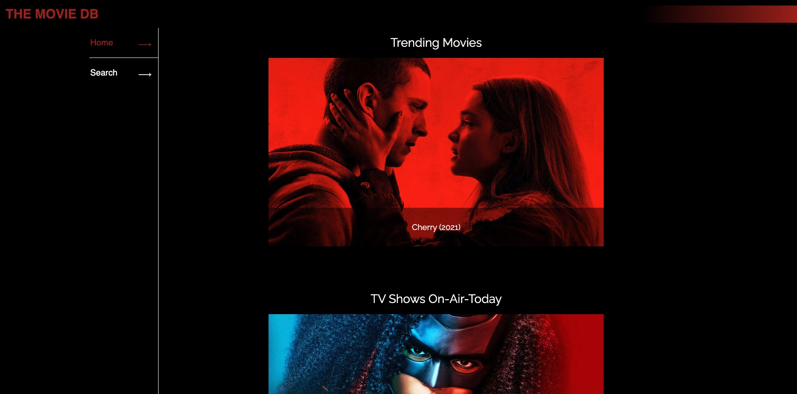
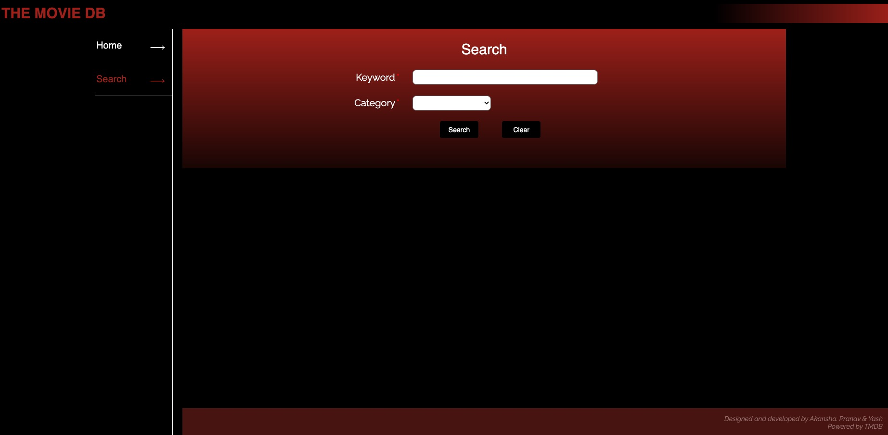
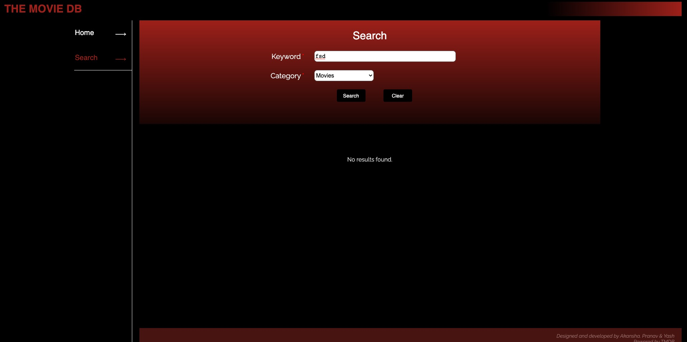
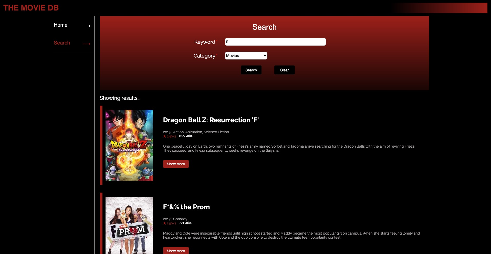
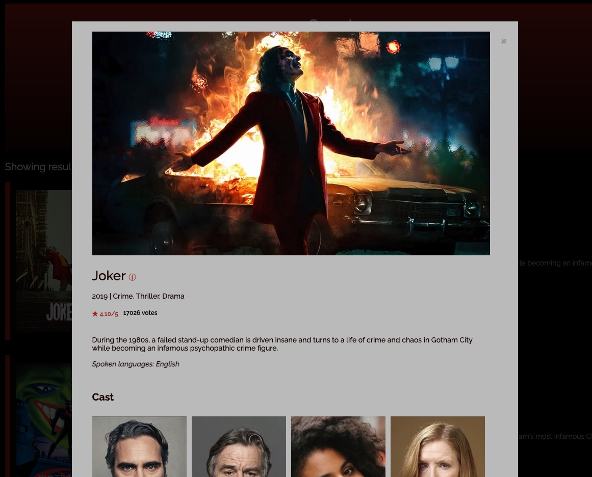
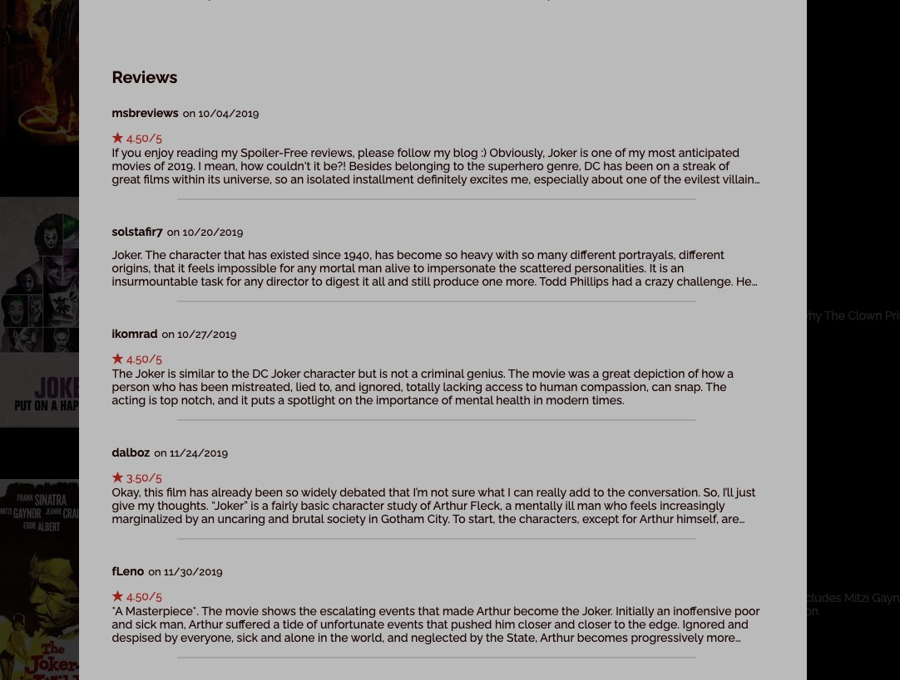

# Movie search system

*   Deployed a full-stack TV show and movie search website for user to search related movies.
*  Accomplished an interactive webpage using ReactJS(include Redux), HTML, CSS in Front-end.
*  Handled HTTP requests and responses (TMDB API) by using Flask.

<br>

## React

* In the  `/Movie_search_react` directory:

<br>

> Install the necessary modules.

```
npm install 

```

<br>

> Start application

```
npm start
```

* Open [http://localhost:3000](http://localhost:3000) to view it in the browser.

<br>
<br>

## Flask

* In the  `/Movie_search_python` directory:

<br>

> Install the necessary modules

```
pip install

```

<br>

> Start service


```
flask run

```
* [http://localhost:5000](http://localhost:5000) will start service.

<br>
<br>

## Screenshots


<div>

</div>

<div>

</div>

<div>

</div>

<div>

</div>

<div>

</div>

<div>

</div>
